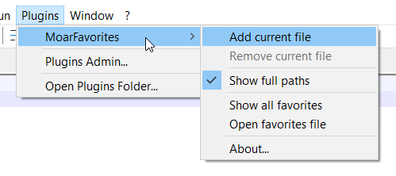
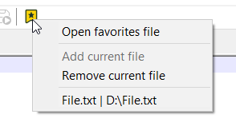
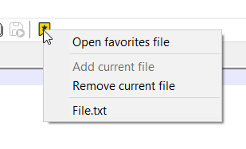

# MoarFavorites
A simple plugin for Notepad++ so you can manage your most used files, as many as you want, with easy access from a toolbar icon.
Add or remove the current file with one click (or edit the config file manually).

  

    
  

  
  

Once I'm proud enough of the source code I'll upload it here, for now it's just the DLLs.

## Compatibility
For now only 32 and 64 bits, sorry ARM users.
| NPP version | 32-bit | 64-bit |
| :---: | :---: | :---: |
| `v8.9.8.1` | ✔️ | ✔️ |
| `v8.9.7` | ✔️ | ✔️ |
| `v8.9.6` | ✔️ | ✔️ |
| `v8.8.8` | ✔️ | ✔️ |
| `v8.2` | ✔️ | ✔️ |
| `v7.8.8` | ✅  ❗ No toolbar button | ✅ ❗ No toolbar button|

## Roadmap
List  of features that may or may not come into existence.
- Get the ARM64 build to work.
- Better bitmap icon.
- ~~About button to show plugin info.~~ Added on v0.0.2
- ~~Localization: Add other common languages (Spanish, French, German...)~~, Added on v0.0.2, still open to sugestions
- ~~Toolbar button implementation for older versions.~~ Added on v0.0.2, only with default icons

---

## About
This was inspired by the existing [NppFavorites](https://github.com/heldersepu/nppfavorites) plugin, adapted to what I actually needed.
